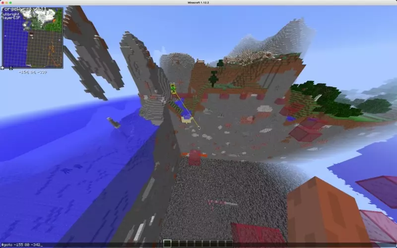

# SwarmBot — tested on 2b2t

  An autonomous bot launcher which can launch hundreds of bots at once
  

## Why use this?

- **Stress testing a server**. When launching a server it is often very hard to predict what CPU usage will be until
  SOTW. This will allow a developer to make optimizations to slow server plugins pre-launch.
- **Anarchy servers**. If an anarchy server allows automation mods, SwarmBot can be used to build, destroy, or attack
  with hundreds of bots.

## What makes this unique?

- **Integrated**. All bots run on a single process. This allows for easy communication between bots and much more
  efficient use of memory as the same chunk does not have to be stored multiple times.
- **Performant**. I am able to run hundreds of bots off of my 2015 laptop with under 10% CPU. This is because SwarmBot
  does not depend on the default Minecraft client. Instead, it completely re-implements physics and
  the [Minecraft protocol](https://wiki.vg/Protocol) in [Rust](https://www.rust-lang.org/) which allows for increadibly
  fast speeds.
- **Easy**. It is very easy to launch as many bots as you want. Simply do `./swarmbot -c {number} {server ip}`,

## Support

Join the discord 

## Features

- ✅  **SOCKS5** — every bot can be launched through a separate IP using a SOCKS proxy.
- ✅  **Account Caching** — valid accounts will be cached and invalid accounts will be pruned.
- ✅  **Incremental path navigation** — `#goto`
- ✅  **Mining** `#mine` — mines in 7×y×7 regions, where y is the highest block in the chunk
- ✅  **Parkour** the best bot for parkouring at bedrock that I know of.
- ✅  **Bucket falling** the bot can fall hundreds of blocks safely by using a water bucket.

## MC Versions

If you want to support a version you will need to implement the `Minecraft` trait for that version.

- ✅ 1.12.*
- ⏳ 1.16 — planned
- Minecraft Bedrock — planned

## Installation

### Bot Launcher

1. Install cargo: https://rustup.rs/
2. Make sure you are using _nightly_ `rustup default nightly`
3. Run `cargo install swarm-bot`
4. You can now execute `swarm-bot` executable to launch swarm bot

### Forge Mod

A forge mod is needed to interact with the bots. Follow the
instructions [here](https://github.com/andrewgazelka/SwarmBotForge)

## Running

See `./swarmbot --help`

## Configuring

You will need two files in the current working directory. **Make sure proxies are not hella sketch**,
they are used for Mojang authentication as well as logging in. If Mojang deems your proxy sketch, the
alt account may get locked. Proxies are recommended as Mojang rate limits auth requests.

- `proxies.csv` a CSV (separated by `:`) of proxies `ip:port:user:pass`
- `users.csv` a CSV (separated by `:`) of users `email:pass`

both CSVs have no header.

# Structure

As of `d4b6d27444347a2bb54f82d212b1ad5a70126edf` the structure is as follows

| Type            | Path                          |
|-----------------|-------------------------------|
| A* progressions | `moves.rs`                    |
| A*              | `pathfind/incremental/mod.rs` |
| Physics         | `physics/mod.rs`              |
| Path follower   | `follow/mod.rs`               |
| Commands        | `bot.rs`                      |
| 1.12 Protocol   | `v340/mod.rs`                 |
| Runner          | `runner.rs`                   |
